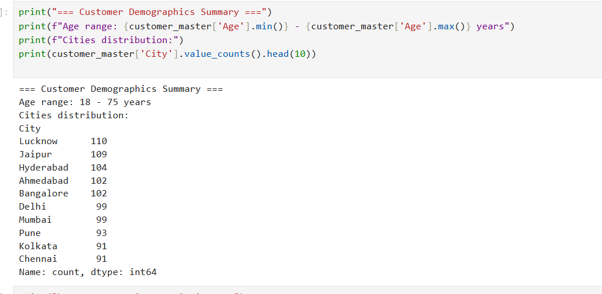
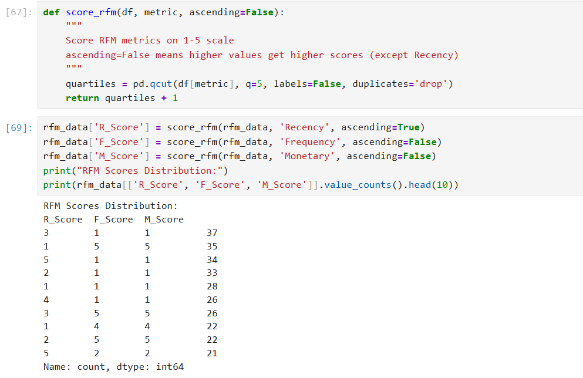
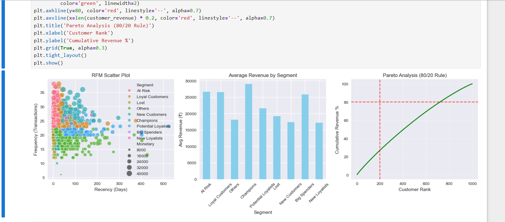
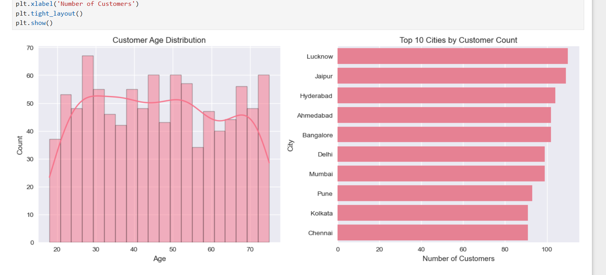
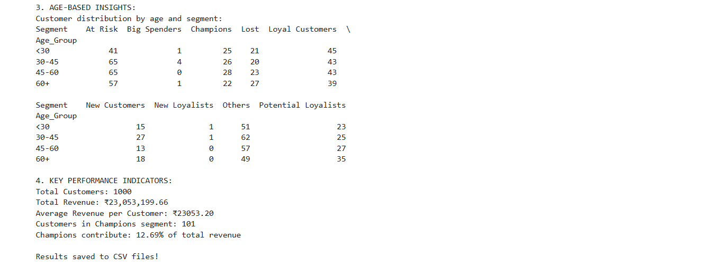
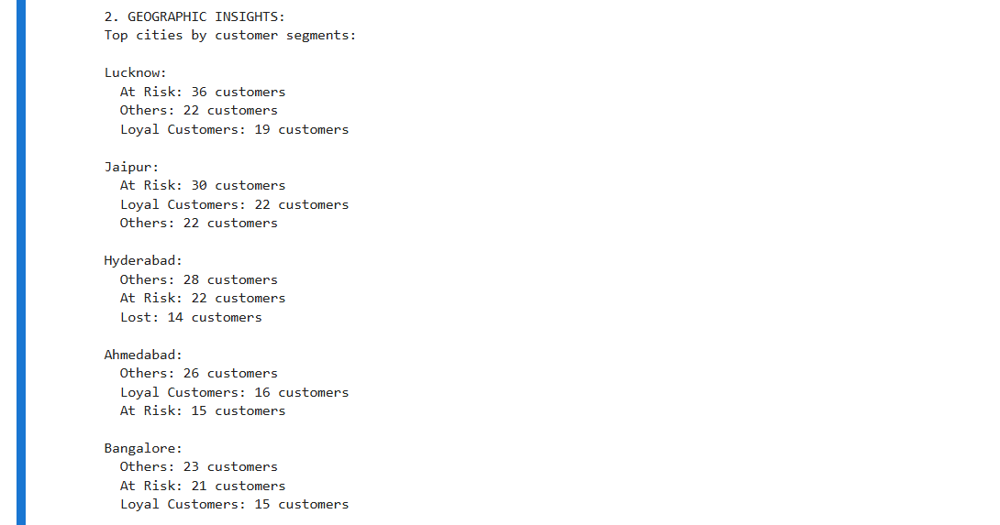
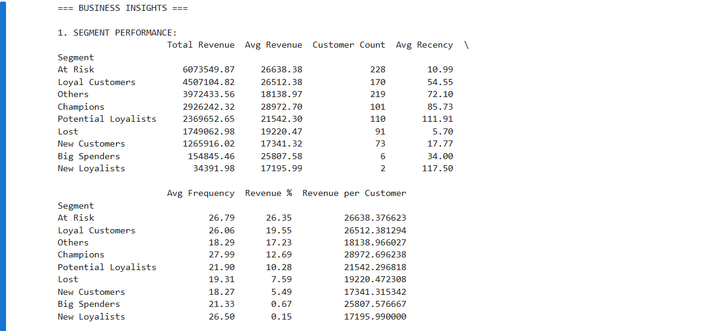
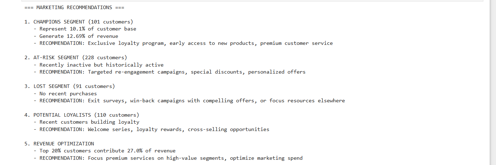

# Customer Data Analysis & RFM Segmentation

## Business problem
Which customers are most valuable, which are drifting away, and where should retention spend go?
## Project Overview

This project analyzes customer transaction data to understand customer behavior and identify valuable customer segments using RFM (Recency, Frequency, Monetary) analysis.

The objective is to transform raw customer data into actionable business insights that can help improve customer retention, increase revenue, and optimize marketing campaigns.

---
---

# 📊 Project Visualizations

<table>
<tr>
<td align="center">
<b>Customer Demographics Summary</b> 

</td>

<td align="center">
<b>RFM Distribution</b> 

</td>
</tr>

<tr>
<td align="center">
<b>Customer Segmentation</b> 

</td>

<td align="center">
<b>Customer Clusters</b> 

</td>
</tr>

<tr>
<td align="center">
<b>Age-Based Insights</b> 

</td>

<td align="center">
<b>Geographic Insights</b> 

</td>
</tr>

<tr>
<td align="center">
<b>Business Insights</b> 

</td>

<td align="center">
<b>Marketing Recommendations</b> 

</td>
</tr>
</table>

---

## Business Problem

Businesses often struggle to identify:

* Their most valuable customers
* Customers at risk of churn
* Loyal repeat buyers
* Opportunities for targeted marketing

This project uses customer analytics and RFM segmentation to address these challenges.

---

## Project Workflow

### 1. Data Cleaning

* Removed missing values
* Corrected data inconsistencies
* Processed transaction records
* Prepared data for analysis

### 2. Exploratory Data Analysis (EDA)

* Customer purchase patterns
* Revenue distribution
* Order frequency analysis
* Customer activity trends

### 3. RFM Analysis

RFM stands for:

* Recency: How recently a customer made a purchase
* Frequency: How often a customer purchases
* Monetary: How much money a customer spends

Customers were scored and segmented based on these metrics.

### 4. Customer Segmentation

Identified key customer groups such as:

* Champions
* Loyal Customers
* Potential Loyalists
* At-Risk Customers
* Lost Customers

### 5. Business Recommendations

Provided data-driven marketing recommendations for each customer segment to improve engagement and retention.

---

## Tools & Technologies

* Python
* Pandas
* NumPy
* Matplotlib
* Seaborn
* Jupyter Notebook

---
## Key results (total spend INR 2.31 crore; average INR 23,053 per customer)
| Segment | Customers | % of customers | % of spend | Avg days since purchase |
|---|---|---|---|---|
| Champions | 127 | 12.7% | 16.2% | 10.7 |
| Loyal Customers | 183 | 18.3% | 20.7% | 22.9 |
| Recent / Potential Loyalists | 192 | 19.2% | 15.7% | 11.6 |
| Needs Attention | 98 | 9.8% | 7.9% | 32.0 |
| At Risk | 260 | 26.0% | 28.8% | 95.3 |
| Lost / Hibernating | 140 | 14.0% | 10.7% | 107.9 |

## Findings
1. **Spend is not concentrated.** The top 10% of customers account for 14.5% of spend and the top 20% for 27.0%, so the usual "80/20" pattern does not hold. Champions and Loyal Customers (31% of customers) hold 36.9% of spend.
2. **A quarter of customers are drifting.** 260 At Risk customers (last purchase about 95 days ago on average) hold INR 66.3 lakh of historical spend (28.8%); 145 of them are in the top spend quintiles (INR 41.2 lakh).
3. **Long inactivity is a smaller group.** 168 customers (16.8%) have not purchased in 90+ days; 50 of them are high-spend (INR 14.1 lakh historical spend).
4. **Pune has the highest share of At Risk customers** (35.5% of 93 customers), followed by Chennai (31.9%).

## Recommendations
- Run win-back offers for the 145 high-spend At Risk customers first.
- Give Champions early access/loyalty benefits; test whether it raises purchase frequency.
- Investigate Pune and Chennai before scaling campaigns there.

## Limitations
Spend figures are historical, not recoverable revenue. Frequency and Monetary are strongly correlated (r = 0.81) and both are fairly evenly spread, so quintile cutoffs define the segments more than natural groupings do. The dataset looks synthetic.

---

---

## Author

Aspiring Data Analyst | Python | Data Analytics | Customer Segmentation

